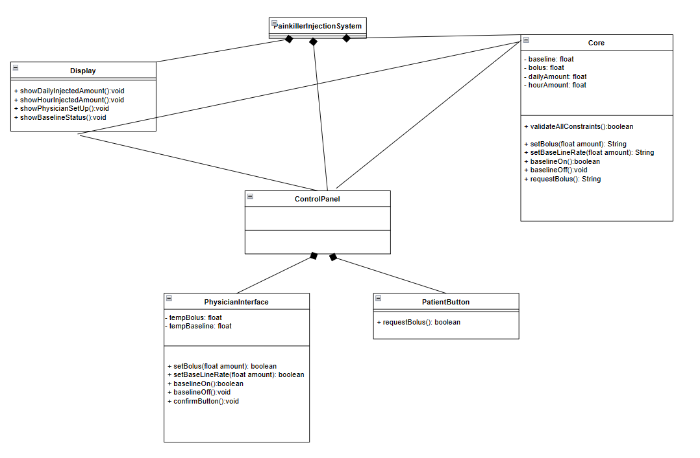
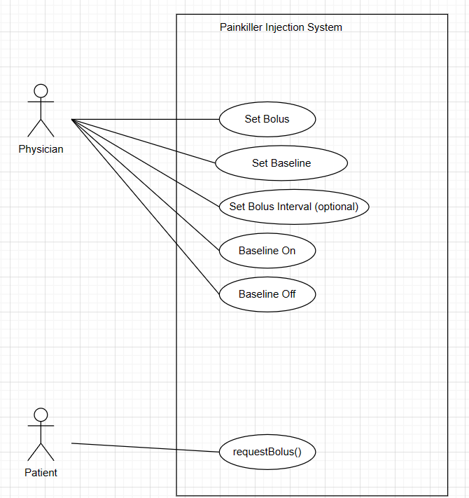

# Painkiller Injection System Requiement 
## Introduction
The Painkiller Injection System is a software project designed to address the need for efficient and accurate pain management through automated injection delivery. Chronic pain management often requires precise dosing and timing of medication, which can be challenging to achieve manually. This system aims to automate the process, providing healthcare professionals with a tool to administer painkillers with greater precision and convenience.

## Basic Requirement
- Limit:
  - total amount per day: 3mL
  - amount at a short period 1mL/hr
- Injection Mode
  - Baseline: 0.01-0.1 mL/min
  - Bolus: 0.2-0.5 mL/shot
- Interface
  - Physician
      - set injection baseline rate and bolus amount
  - Patient
    - button to request bolus

## Domain Analysis
The participants are one patient, one doctor and a painkiller injection system. The doctor can set injection parameters on the system, the system can inject painkiller to patient automatically. The patient can request a bolus when severe pain attacks.

## Class Diagram

## Use case

## Requirements
### R1 Physician UI
- R1.1 Physician operations
  - R1.1.1 Physician should be able to set baseline rate
  - R1.1.2 Physician should be able to set bolus amount
  - R1.1.3 Physician should be able to turn on baseline injection
  - R1.1.4 Physician should be able to turn off baseline injection
- R1.2 Physician view
  - R1.2.1 Physician should be able to monitor hour and daily injection amount.
  - R1.2.2 Physician should be able to monitor current baseline, bolus amount
  - R1.2.3 Physician should be able to monitor current baseline injection mode (on/off)
### R2 Patient Button
- R2.1 Patient should be able to press the button to request bolus
### R3 Injection System Core
- R3.1 System should validate user operation 
  - R3.1.1 System should be able to ensure baseline between 0.01-0.1 mL/min
  - R3.1.2 System should be able to ensure bolus between 0.2-0.5 mL/shot 
- R3.2 System basic functionality
  - R3.2.1 System should be able to inject baseline every minute according to baseline set by physician if baseline mode is on.
  - R3.2.2 System should be able to inject bolus immediately once patient pressed button and that amount is validated.(valid if injecting bolus will not cause total amount to exceed hour limit and day limit)
  - R3.2.3 System should be able to stop baseline injection automatically if injecting baseline will cause current amount to exceed daily amount or hour amount.
  - R3.2.4 System should restart baseline injection automatically when injecting baseline will not cause current amount to exceed daily amount or hour amount.
### R4 Additional Feature
- R4.1 Dynamic amount visualisation
  - R4.1.1 On doctor ui, a dynamic line chart should be displayed to demonstrate injected amount trend within an hour.
  - R4.1.1 On doctor ui, a dynamic line chart should be displayed to demonstrate injected amount trend within a day

